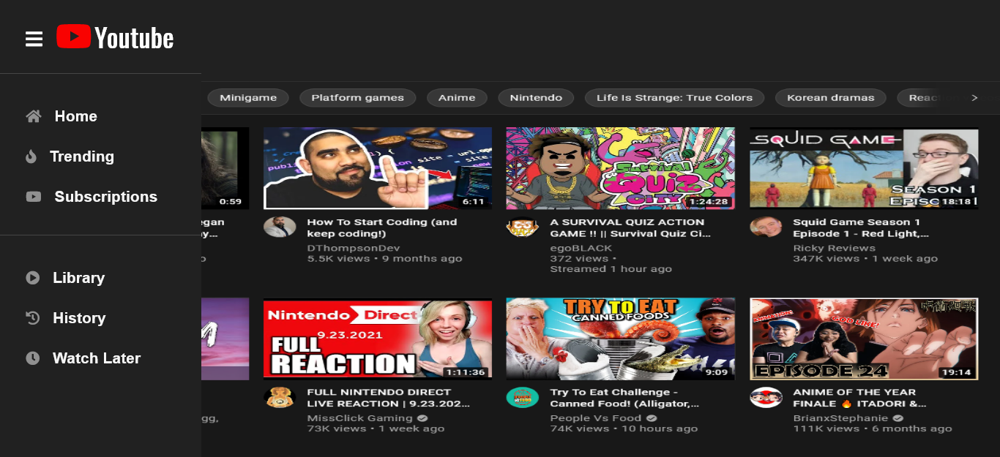

<h1>Navbar Sidebar Menu YouTube Clone</h1>

<h2>A navbar sidebar menu using HTML, CSS, and JavaScript.</h2>

This project is created using a bit of flexbox and position property. I created this following the tutorial of Brain Design. I've changed the images and updated the values of measures from px to rem. This project was beginner friendly to create and to understand how to create a youtube clone navbar sidebar menu.

### Link

- Live Site: [Navbar Sidebar Menu]()

### Screenshot

